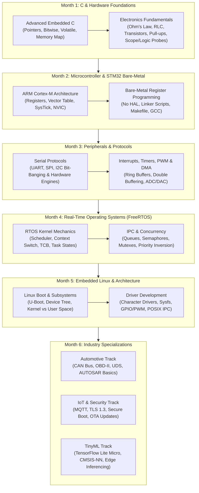

# ⚡ The Complete Embedded Engineering Roadmap

[](https://opensource.org/licenses/MIT)
[](CONTRIBUTING.md)
[](ROADMAP.md)
[](#-curriculum-overview)
[](#-recommended-hardware-kit-under-50)

> **A battle-tested, zero-cost, structured curriculum from absolute fresher to industry-ready embedded systems engineer.**  
> Merging rigorous computer architecture, bare-metal C, RTOS internals, embedded Linux, and modern specializations (Automotive CAN/AUTOSAR, IoT Security, TinyML) with a comprehensive SOFTWARE / HARDWARE / SOFT-SKILLS taxonomy, 7 production-grade portfolio projects, and quality-rated resources.

---

## 🧭 Table of Contents

- [Why This Roadmap Exists](#-why-this-roadmap-exists)
- [How to Use This Roadmap](#-how-to-use-this-roadmap)
- [Interactive 6-Month Visual Roadmap](#-interactive-6-month-visual-roadmap)
- [Curriculum Overview (Month by Month)](#-curriculum-overview)
- [The 3 Pillars of Embedded Systems Taxonomy](#-the-3-pillars-of-embedded-systems-taxonomy)
- [7 Production-Grade Portfolio Projects](#-7-production-grade-portfolio-projects)
- [Quick Reference Cheatsheets](#-quick-reference-cheatsheets)
- [Quality-Rated Resource Hub](#-quality-rated-resource-hub)
- [Recommended Hardware Kit (Under $50)](#-recommended-hardware-kit-under-50)
- [Repository Structure](#-repository-structure)
- [Contributing](#-contributing)
- [License](#-license)

---

## 🎯 Why This Roadmap Exists

Most embedded systems resources suffer from one of two extremes:
1. **Academic Abstraction:** Pure theory with 8051 or Arduino sketches that hide registers, memory layout, vector tables, and DMA behind `digitalWrite()` and `delay()`.
2. **Scattered Professional Chaos:** Advanced forum posts, incomplete 1500-page vendor datasheets, and outdated Linux kernel driver guides with no coherent step-by-step path.

This roadmap bridges that chasm. It is designed to take a college student, computer science / electrical engineering fresher, or software engineer transitioning from web/mobile/backend, and turn them into an engineer who can:
- Read silicon reference manuals, register maps, and schematic schematics with ease.
- Write deterministic, MISRA-C compliant bare-metal firmware without external vendor bloat.
- Debug hard-faults, race conditions, and signal integrity anomalies using an oscilloscope and logic analyzer.
- Design preemptive, concurrent systems on RTOS (FreeRTOS) and write custom character drivers in Embedded Linux.
- Excel in embedded systems engineering technical interviews at top automotive, aerospace, industrial, and semiconductor firms.

---

## 🛠️ How to Use This Roadmap

```
  ┌─────────────────────────────────────────────────────────────┐
  │ Track 1: Absolute Fresher / Undergraduate Student           │
  │ Follow Month 1 through Month 6 sequentially (20 hrs/week)  │
  └──────────────────────────────┬──────────────────────────────┘
                                 │
  ┌──────────────────────────────▼──────────────────────────────┐
  │ Track 2: CS / Software Engineer Transitioning to Embedded   │
  │ Fast-track Month 1 (focus on Electronics), deep-dive M2-M6  │
  └──────────────────────────────┬──────────────────────────────┘
                                 │
  ┌──────────────────────────────▼──────────────────────────────┐
  │ Track 3: Electrical / Electronics Grad Strengthening Code   │
  │ Deep-dive Month 1 (C Pointers, Memory), M2 & M4 (RTOS)      │
  └─────────────────────────────────────────────────────────────┘
```

- **Hands-on Rule:** Never read a concept without compiling code or probing a pin. Every week pairs theory with a practical lab.
- **Zero-Hardware Option:** If you do not yet own hardware, every peripheral lab up to Month 4 can be simulated in **Wokwi** or **QEMU ARM**. See [Simulators Guide](03-resource-hub/simulators-and-tools.md).

---

## 🗺️ Interactive 6-Month Visual Roadmap



---

## 📚 Curriculum Overview

| Month | Theme | Core Competencies | Capstone Milestone |
| :--- | :--- | :--- | :--- |
| **Month 1** | **C Mastery & Electronics Foundations** | Bitwise tricks, pointer arithmetic, memory layout (stack/heap/BSS/data/text), `volatile`, `const`, `restrict`, circuits, pull-ups, transistors, multimeter, oscilloscope basics | [Bitwise Register Emulator & Circuit Diagnostic Lab](01-curriculum/month-01-c-and-electronics/) |
| **Month 2** | **ARM Cortex-M & Bare-Metal STM32** | Cortex-M4 internals, vector tables, reset sequence, RCC clock trees, bare-metal GPIO registers, GNU `arm-none-eabi-gcc` toolchain, linker scripts (.ld), Makefiles | [Project 1: Bare-Metal GPIO & SysTick FSM](04-portfolio-projects/project-01-baremetal-gpio-systick/) |
| **Month 3** | **Peripherals & Communication Protocols** | UART with circular ring buffers, SPI master/slave, I2C state machine, Timers & PWM, NVIC priority grouping, ADC with DMA transfers | [Project 2: I2C Sensor Driver & DMA UART CLI](04-portfolio-projects/project-02-i2c-sensor-uart-dma/) |
| **Month 4** | **Real-Time Operating Systems (FreeRTOS)** | Preemption vs cooperative scheduling, context switching assembly, TCB, task priorities, queues, mutexes, binary/counting semaphores, priority inversion (PIP), event groups | [Project 3: Multi-Task FreeRTOS Data Logger](04-portfolio-projects/project-03-freertos-data-logger/) |
| **Month 5** | **Embedded Linux & System Architecture** | Cross-compiling, U-Boot, Device Tree Source (DTS), Linux kernel architecture, character device drivers, `sysfs` & `ioctl`, POSIX multi-threading | [Project 5: Custom Linux Kernel Module & App](04-portfolio-projects/project-05-embedded-linux-driver/) |
| **Month 6** | **Advanced Specialization & Portfolio Polish** | Choose one or more tracks: Automotive CAN/AUTOSAR, Secure IoT Edge Device, or TinyML On-Device Inferencing | [Projects 4, 6, or 7 Showcase](04-portfolio-projects/) |

👉 **Full weekly schedule, day-by-day guides, exercises, and deliverables:**  
Read [`ROADMAP.md`](ROADMAP.md).

---

## 🏛️ The 3 Pillars of Embedded Systems Taxonomy

A complete engineer is not just someone who writes C or solders wires. Industry competence requires three interlocking pillars:

```
                  ┌─────────────────────────────────────────┐
                  │    THE EMBEDDED SYSTEMS ENGINEER        │
                  └────────────────────┬────────────────────┘
             ┌─────────────────────────┼─────────────────────────┐
             │                         │                         │
  ┌──────────▼───────────┐  ┌──────────▼───────────┐  ┌──────────▼───────────┐
  │   1. SOFTWARE        │  │   2. HARDWARE        │  │   3. SOFT-SKILLS     │
  ├──────────────────────┤  ├──────────────────────┤  ├──────────────────────┤
  │ • Embedded C & C++   │  │ • Digital Logic      │  │ • Reading Datasheets │
  │ • Bare-Metal Drivers │  │ • Analog & Power     │  │ • Systematic Debug   │
  │ • Concurrency & RTOS │  │ • MCU Architectures  │  │ • Git & Code Reviews │
  │ • Embedded Linux     │  │ • Schematics & PCB   │  │ • Technical Specs    │
  │ • Network Protocols  │  │ • Signal Integrity   │  │ • System Design Prep │
  │ • Defensive Coding   │  │ • Lab Instrumentation│  │ • Cross-Team Collab  │
  └──────────────────────┘  └──────────────────────┘  └──────────────────────┘
```

- [**Software Taxonomy (`software-taxonomy.md`)**](02-taxonomy/software-taxonomy.md): Complete index of languages, memory architectures, RTOS mechanics, Linux subsystems, protocol stacks, testing frameworks (Unity, Ceedling), and MISRA guidelines.
- [**Hardware Taxonomy (`hardware-taxonomy.md`)**](02-taxonomy/hardware-taxonomy.md): Detailed reference covering microcontrollers (ARM, RISC-V, ESP32), power supplies (LDO vs Buck), buses, signal integrity, schematic capture, and PCB routing.
- [**Soft Skills & Engineering Practices (`soft-skills-taxonomy.md`)**](02-taxonomy/soft-skills-taxonomy.md): How to read 1500+ page reference manuals, systematic root-cause analysis, laboratory hygiene, technical communication, and embedded portfolio building.

---

## 🚀 7 Production-Grade Portfolio Projects

Each project in this repository includes architecture schematics, hardware wiring diagrams, register-level explanations, and clean source code:

| # | Project Name | Target Platform | Complexity | Key Technologies | Link |
| :-: | :--- | :--- | :--- | :--- | :--- |
| **01** | **Bare-Metal GPIO & SysTick FSM Driver** | STM32F401 / F411 | Beginner | Pure Register C (no HAL), SysTick timer, Debounced Button FSM, Custom Linker Script & Makefile | [Explore Project 1](04-portfolio-projects/project-01-baremetal-gpio-systick/) |
| **02** | **I2C Sensor Driver & DMA UART Shell** | STM32F4 / ESP32 | Beginner-Int | I2C Bit-level Driver (BMP280/MPU6050), Circular Ring Buffer, DMA RX/TX, Interactive Command CLI | [Explore Project 2](04-portfolio-projects/project-02-i2c-sensor-uart-dma/) |
| **03** | **Multitasking Environmental Data Logger** | STM32 / FreeRTOS | Intermediate | FreeRTOS Queues, Mutexes, Software Timers, SPI Flash/SD Card, OLED Display, Low-Power Sleep | [Explore Project 3](04-portfolio-projects/project-03-freertos-data-logger/) |
| **04** | **Automotive CAN Bus Gateway & Telemetry** | STM32 / ESP32 CAN | Int-Advanced | CAN 2.0B / CAN-FD, Identifier Filtering & Masks, OBD-II PID Parser, Fault Handling & Bus-off Recovery | [Explore Project 4](04-portfolio-projects/project-04-automotive-can-node/) |
| **05** | **Embedded Linux Custom Device Driver** | BeagleBone / Pi / QEMU | Advanced | Linux Kernel Module (LKM), Character Device, `sysfs` & `ioctl`, Hardware Interrupts, User-space POSIX daemon | [Explore Project 5](04-portfolio-projects/project-05-embedded-linux-driver/) |
| **06** | **Secure Edge IoT Client with MQTT & OTA** | ESP32 / STM32+WiFi | Advanced | TLS 1.3, mTLS X.509 Authentication, MQTT Publisher/Subscriber, Dual-Bank Flash A/B OTA Rollback | [Explore Project 6](04-portfolio-projects/project-06-secure-iot-mqtt-ota/) |
| **07** | **TinyML Real-Time Motion/Gesture Classifier** | ARM Cortex-M4F | Capstone | TensorFlow Lite for Microcontrollers, CMSIS-NN Quantized INT8 Inference, 6-Axis IMU DSP Pipeline | [Explore Project 7](04-portfolio-projects/project-07-tinyml-gesture-classifier/) |

---

## ⚡ Quick Reference Cheatsheets

Ready-to-print and quick-lookup cheatsheets located in [`05-cheatsheets/`](05-cheatsheets/):

- [`embedded-c-cheatsheet.md`](05-cheatsheets/embedded-c-cheatsheet.md): Bit manipulation masks, pointer to function, `volatile` uses, endianness macros, packing structs.
- [`arm-cortex-m-cheatsheet.md`](05-cheatsheets/arm-cortex-m-cheatsheet.md): Core registers, NVIC priority calculation, vector table layout, fault status registers (CFSR/HFSR).
- [`communication-protocols-cheatsheet.md`](05-cheatsheets/communication-protocols-cheatsheet.md): UART, SPI, I2C, CAN comparison matrix, bus topologies, pull-up formulas, timing calculations.
- [`freertos-api-cheatsheet.md`](05-cheatsheets/freertos-api-cheatsheet.md): Tasks, Queues, Semaphores, Mutexes, Event Groups, Task Notifications API reference & ISR rules.
- [`embedded-linux-cheatsheet.md`](05-cheatsheets/embedded-linux-cheatsheet.md): Device Tree syntax, U-Boot commands, Kernel module boilerplate, `dmesg`, `gdb` cross-debugging.
- [`hardware-debugging-cheatsheet.md`](05-cheatsheets/hardware-debugging-cheatsheet.md): Oscilloscope trigger setups, logic analyzer decoding, multimeter continuity tests, common hardware gotchas.

---

## 💎 Quality-Rated Resource Hub

Every resource in [`03-resource-hub/`](03-resource-hub/) has been verified and rated across:
- **Quality Score:** ★★★★★ (5/5) to ★★★☆☆ (3/5)
- **Difficulty Level:** Beginner, Intermediate, or Advanced
- **Cost:** Free, Open Source, or Paid
- **Key Takeaway:** Exactly why and when to study it.

### Highlights:
- **Top Books:** *Making Embedded Systems* (Elecia White), *Mastering STM32* (Carmine Noviello), *Linux Device Drivers* (Corbet et al.), *Embedded Systems: Real-Time Interfacing* (Valvano).
- **Top Video Channels:** Miro Samek (State Machines & RTOS), Phil's Lab (STM32 & PCB Design), FastBit Academy (Kiran Nayak), Low Level Learning.
- **Top Free Simulators:** Wokwi (STM32, ESP32, Raspberry Pi Pico), QEMU ARM System Emulation, Renode Antmicro.
- **Interactive Practice:** [Interview Prep 50+ Real Questions](03-resource-hub/interview-prep.md).

---

## 🛒 Recommended Hardware Kit (Under $50)

You do **not** need a multi-thousand-dollar laboratory to become a proficient embedded engineer. Here is the recommended student starter kit:

| Item | Model / Specification | Approximate Cost | Why You Need It |
| :--- | :--- | :--- | :--- |
| **Microcontroller Board** | STM32F401CCU6 or STM32F411CEU6 ("Black Pill") | ~$4.50 | Cortex-M4 with FPU, 84-100MHz, 512KB Flash, native USB |
| **Hardware Programmer** | ST-Link V2 Clone or DAPLink | ~$3.00 | SWD flashing and step-by-step GDB debugging |
| **Logic Analyzer** | 24MHz 8-Channel USB Logic Analyzer (Saleae Clone) | ~$7.00 | Essential for decoding UART, I2C, SPI waveforms using PulseView |
| **USB-to-UART Adapter** | FTDI FT232RL or CP2102 Module | ~$2.50 | Serial debugging terminal output to PC |
| **Digital Multimeter** | Basic Auto-ranging DMM (e.g. AN8002) | ~$14.00 | Voltage measurement, continuity testing, resistance checking |
| **Sensors & Actuators** | BMP280 (I2C/SPI), MPU6050 (6-axis IMU), LEDs, Pushbuttons | ~$6.00 | Real sensor registers, interrupts, and I2C buses |
| **Breadboard & Jumpers** | 830-point breadboard + male-to-male & male-to-female jumpers | ~$4.00 | Rapid prototyping without soldering |
| **Secondary Board (Optional)**| ESP32-WROOM-32 Development Board | ~$4.50 | Wi-Fi, BLE, FreeRTOS dual-core, and IoT networking |
| **TOTAL** | | **~$45.50** | **Complete hardware development lab!** |

---

## 📂 Repository Structure

```
embedded-engineering-roadmap/
├── .github/                       # Issue templates, PR templates, and GitHub CI workflow
│   ├── ISSUE_TEMPLATE/
│   │   ├── bug_report.md
│   │   ├── feature_request.md
│   │   └── resource_suggestion.md
│   ├── PULL_REQUEST_TEMPLATE.md
│   └── workflows/
│       └── ci.yml
├── 01-curriculum/                 # Month-by-month curriculum with weekly syllabi & exercises
│   ├── month-01-c-and-electronics/
│   ├── month-02-microcontroller-and-stm32/
│   ├── month-03-peripherals-and-protocols/
│   ├── month-04-rtos/
│   ├── month-05-embedded-linux/
│   └── month-06-advanced-specializations/
├── 02-taxonomy/                   # Software, Hardware, and Soft-Skills domain mastery
│   ├── software-taxonomy.md
│   ├── hardware-taxonomy.md
│   └── soft-skills-taxonomy.md
├── 03-resource-hub/               # Rated books, courses, simulators, hardware and interview prep
│   ├── books-and-courses.md
│   ├── simulators-and-tools.md
│   ├── hardware-buying-guide.md
│   └── interview-prep.md
├── 04-portfolio-projects/         # 7 end-to-end portfolio projects with code and schematics
│   ├── project-01-baremetal-gpio-systick/
│   ├── project-02-i2c-sensor-uart-dma/
│   ├── project-03-freertos-data-logger/
│   ├── project-04-automotive-can-node/
│   ├── project-05-embedded-linux-driver/
│   ├── project-06-secure-iot-mqtt-ota/
│   └── project-07-tinyml-gesture-classifier/
├── 05-cheatsheets/                # Quick-reference cheatsheets for daily engineering work
│   ├── embedded-c-cheatsheet.md
│   ├── arm-cortex-m-cheatsheet.md
│   ├── communication-protocols-cheatsheet.md
│   ├── freertos-api-cheatsheet.md
│   ├── embedded-linux-cheatsheet.md
│   └── hardware-debugging-cheatsheet.md
├── 06-code-examples/              # Reusable patterns, bare-metal templates, and data structures
│   ├── baremetal-stm32f4-blinky/
│   ├── ring-buffer-uart/
│   ├── freertos-producer-consumer/
│   └── bit-manipulation-snippets/
├── CONTRIBUTING.md                # Guide for community contributors
├── CODE_OF_CONDUCT.md            # Contributor Covenant Code of Conduct
├── LICENSE                        # MIT License
├── ROADMAP.md                     # Complete 24-week granular learning schedule
└── README.md                      # This main navigation guide
```

---

## 🤝 Contributing

We welcome contributions from students, educators, and embedded industry veterans!
Whether you want to fix a typo, add a new project example, expand a cheatsheet, or recommend a quality resource:

1. Read [`CONTRIBUTING.md`](CONTRIBUTING.md).
2. Check existing [Issues](https://github.com/Abhicm14/embedded-engineering-roadmap/issues).
3. Submit a Pull Request following our PR template.

---

## 📄 License

This repository is licensed under the [MIT License](LICENSE). You are free to use, share, adapt, and build upon this curriculum for personal study, university courses, or company onboarding.
