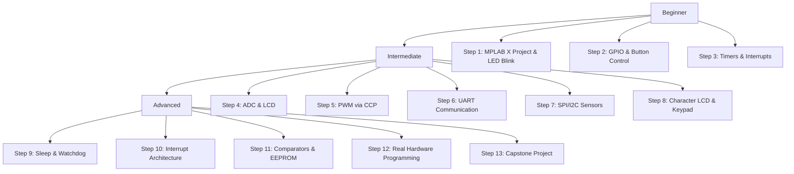

# 🔌 PIC Microcontrollers with MPLAB X, XC8 & PICSimLab

> A complete beginner-to-advanced guide for PIC microcontrollers using MPLAB X IDE, XC8 compiler, and PICSimLab simulator. Follows the core rule: **understand the register, not just the API**.

## 📖 Overview

This track teaches PIC microcontroller programming at the register level, focusing on the PIC16F877A as a learning platform. You'll progress from basic LED blinking to advanced topics like PID control and real-world hardware interfacing.

**Core Philosophy**: Every line of code is explained in terms of register manipulation, timing diagrams, and electrical characteristics—not just API calls.

> [!IMPORTANT]
> **Writing Your Own Drivers from the Datasheet:**  
> Before writing code, study our dedicated master guide: [**📖 How to Read Any Silicon Datasheet & Write Custom Peripheral Drivers (`datasheet-driver-guide.md`)**](datasheet-driver-guide.md).  
> Looking for the complete register-by-register breakdown for Port B? Read our [**🔌 Bare-Metal PIC GPIO Walkthrough (`gpio-bare-metal-walkthrough.md`)**](gpio-bare-metal-walkthrough.md).  
> Ready to write your own drivers? Use your personal workspace: [**`my-code/pic16f877a/`**](../my-code/pic16f877a/README.md).

## 🛠️ Toolchain

- **MPLAB X IDE v5.35** (~1GB) - Integrated development environment
- **XC8 Compiler (Free License)** - ANSI C compiler for 8-bit PIC devices
- **PICSimLab v0.7** - Real-time simulator for PIC and Arduino devices
- **Optional Hardware**: PICkit 3/4 programmer and PIC16F877A for final validation

## 🗺️ Learning Sequence

Follow this structured path from beginner to advanced. Each step includes theory, code, simulation procedure, and validation checklist.

### Beginner → Intermediate → Advanced Checklist

#### ✅ Beginner Foundation
- [ ] Create first MPLAB X project for PIC16F877A
- [ ] Configure `#pragma config` bits correctly
- [ ] Implement LED blink with `__delay_ms()`
- [ ] Measure timing with oscilloscope (simulated/virtual)
- [ ] Understand TRIS vs PORT vs LAT registers
- [ ] Implement button debouncing in firmware
- [ ] Use Timer0 with overflow interrupt for precise timing
- [ ] Replace software delays with hardware timer ISR

#### ✅ Intermediate Peripherals
- [ ] Read analog voltage via ADC and display on LCD
- [ ] Generate PWM signals using CCP module
- [ ] Implement UART serial communication at 9600 baud
- [ ] Communicate with I2C temperature sensor (simulated)
- [ ] Interface 4-bit character LCD in simulation
- [ ] Scan 4x4 keypad matrix using GPIO
- [ ] Troubleshoot common peripheral configuration issues

#### ✅ Advanced Applications
- [ ] Implement sleep modes and watchdog timer
- [ ] Design interrupt-driven architecture with context saving
- [ ] Use analog comparators for zero-crossing detection
- [ ] Store calibration data in internal EEPROM
- [ ] Program real PIC16F877A via PICkit and ICSP
- [ ] Build capstone: PID temperature controller OR UART-to-Python bridge
- [ ] Document register-level understanding in project report

## 📚 Next Steps

After completing this track:
1. Explore other PIC families (PIC18F, PIC24, PIC32) using similar principles
2. Study advanced topics: USB, CAN, Ethernet connectivity on PIC32MZ
3. Contribute to open-source PIC projects on GitHub
4. Prepare for embedded interviews with register-level PIC questions

> **Remember**: The goal isn't to memorize register addresses—it's to understand how to *find* and *interpret* them in any datasheet. This skill transfers across all microcontroller architectures.
